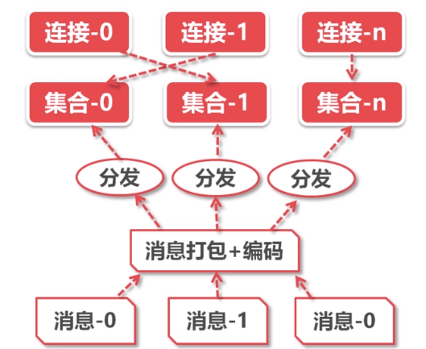
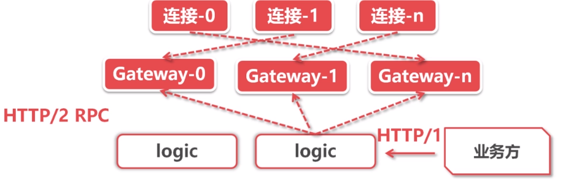

# Tens-of-thousands-of-messages-pushed
千万级WebSocket消息推送

### 技术复杂度分析
- 在线人数: 100万
- 发送消息: 1000条/秒
- 推送频率: 100万 * 1000条/秒 = 10亿条/秒
- N个业务推送频率: N * 10亿条/秒

### 推模式与拉模式
- 拉模式
    - 数据更新频率低,大多数请求是无效的
    - 在线用户数多,服务端查询负载高
    - 定时轮询拉取,无法满足时效性要求
- 推模式
    - 仅在数据更新时才需要推送
    - 需要维护大量的在线长连接
    - 数据更新立即推送,高时效性
- 基于WebSocket协议
    - 浏览器支持socket编程,轻松维持服务端长连接
    - 基于TCP可靠传输之上的协议,无需关系通讯细节
    - 提供高度抽象编程接口,业务才发成本较低
    
### 服务端技术选项
- NodeJS
    - 单线程模型,推送性能有效
- C/C++
    - TCP通讯,WebSocket协议实现成本高
- Go
    - 多线程,基于协程模型并发
    - 成熟的WebSocket标准库,不需造轮子
    
### 技术难点
- 3个性能瓶颈
    - 内核瓶颈
        - 推送量大: 100万在线*10条/秒 = 1000万条/秒
        - linux内核发送TCP的极限包频率 约为 100万/秒
    - 锁瓶颈
        - 需要维护在线用户集合(100万在线),通常是一个字典结构
        - 推送消息即遍历整个集合,顺序发送消息,耗时极长
        - 推送期间,客户端仍旧正常上/下线,所以集合需要上锁
    - CPU瓶颈
        - 浏览器与客户端通常采取json格式通讯
        - json编码非常耗费CPU资源
        - 向100万在线推送1次,则需100万次json encode
### 解决方案
- 内核瓶颈 
    - 优化原理
        - 减少网络小包的发送
    - 优化方案
        - 将同一s内的n条消息,合并成1条消息
        - 合并后,每秒推送次数只等于在线连接数
- 锁瓶颈
    - 优化原理
        - 大拆小
    - 优化方案
        - 连接打散到多个集合中,每一个集合有自己的锁
        - 多协程并发推送多个集合,避免锁的竞争
        - 读写锁取代互斥锁,多个推送可以并发遍历相同集合
- CPU瓶颈
    - 优化原理
        - 减少重复计算
    - 优化方案
        - json编码前置,1次消息编码 + 100 万次推送
        - 消息合并前置,n条消息合并后只编码一次
- 单机架构

    
- 分布式架构
    - 单机瓶颈
        - 维护海量长连接会话费不少内存
        - 消息推送瞬间消耗大量CPU资源
        - 消息推送瞬时带宽高达400~600MB(4-6Gbits),主要瓶颈 
- 网管集群
    - 每一个消息进来 分配给不同的网管
        - 这时就会出现问题,返回消息怎么知道是那个网管的呢?(一般广播解决)
- 逻辑集群
    - 基于HTTP/2协议想gateway集群分发消息
        - HTTP/2支持链接复用,用于PRC性能更佳
    - 基于HTTP/1协议对外提供推送API
        - HTTP/1更加普及,对业务方更加友好

