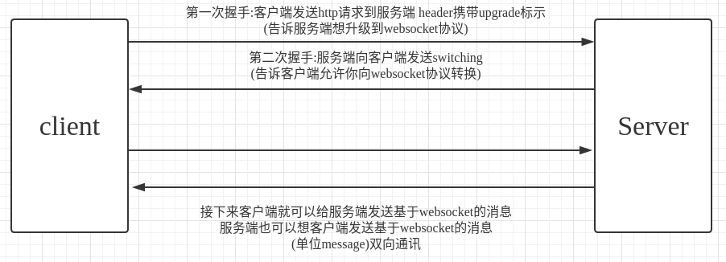

GO WebSocket协议与交互流程
===

### 通讯流程


### 传输原理
- 协议升级后,继续复用HTTP的底层socket完成后续通讯
- message底层被切分成多个frame帧数据
- 编程时只需操作message,无需关系frame
- 框架底层完成TCP网络的I/O,WebSocket协议解析,开发者无需关心

### 实现HTTP客户度
- websocket是http协议upgrade而来
- 使用http标准库快速实现空接口:/ws

### 实现WebSocket握手
- 使用websocket.Upgrader完成协议握手,得到websocket长连接
- 操作websocket api,读取客户度消息,然后原样返回
``` 
var (
	upgrader = websocket.Upgrader{
		// 允许跨域
		CheckOrigin: func(r *http.Request) bool {
			return true
		},
	}
)

func wsHandler(w http.ResponseWriter,r *http.Request,p httprouter.Params)  {
	conn, e := upgrader.Upgrade(w, r, nil) // 握手应答
	defer conn.Close()
	if e != nil {
		panic(e.Error())
	}

	// websocket.Conn
	for {
		// 支持数据体
		// Text,Binary
		_, data, e := conn.ReadMessage()
		if e != nil {
			panic(e.Error())
		}
		// 发送消息
		e = conn.WriteMessage(websocket.TextMessage, data)
		if e != nil {
			panic(e.Error())
		}

	}
}
```
### 封装WebSocket
- 缺乏工程化设计
    - 其他代码模块,无法直接操作WebSocket连接
    - WebSocket连接非线程安全,并发读/写需要同步手段
- 隐藏细节,封装API
    - 封装Connection结构,隐藏WebSocket底层连接
    - 封装Connection的API,提供Send/Read/Close等线程安全接口
- API原理
    - SendMessage消息投递到out channel
    - ReadMessage从in channel读取消息
- 内部原理
    - 启动读协程,循环读取WebSocket,将消息投递到in channel
    - 启动写协程,循环读取out channel,将消息写给WebSocket
    